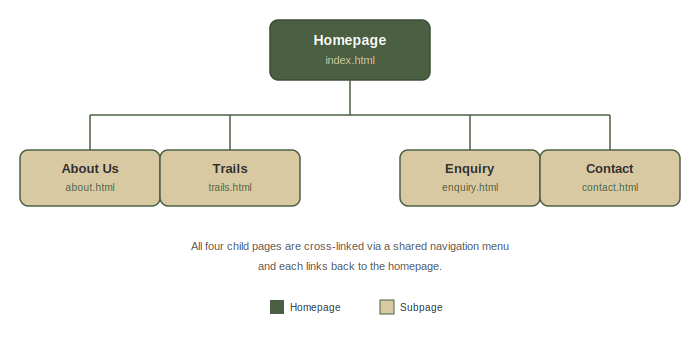
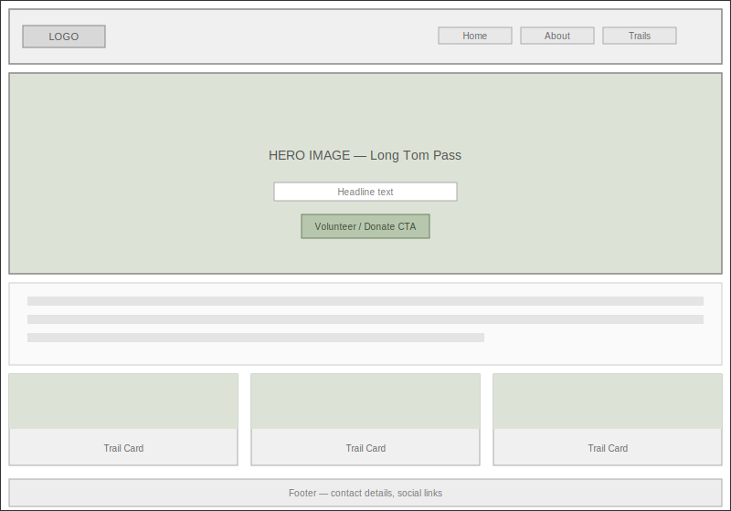
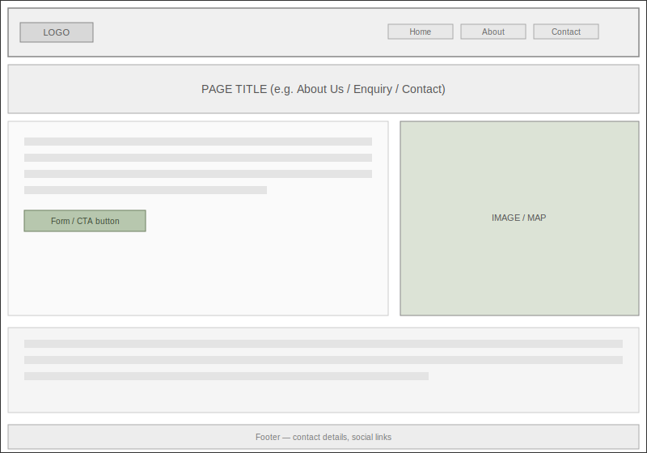
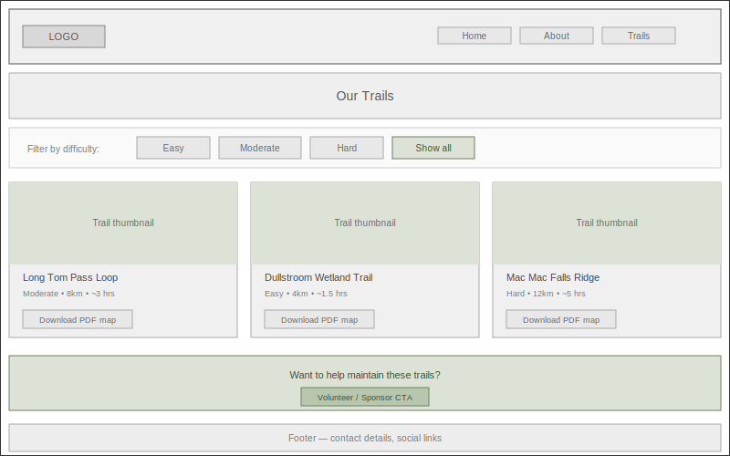
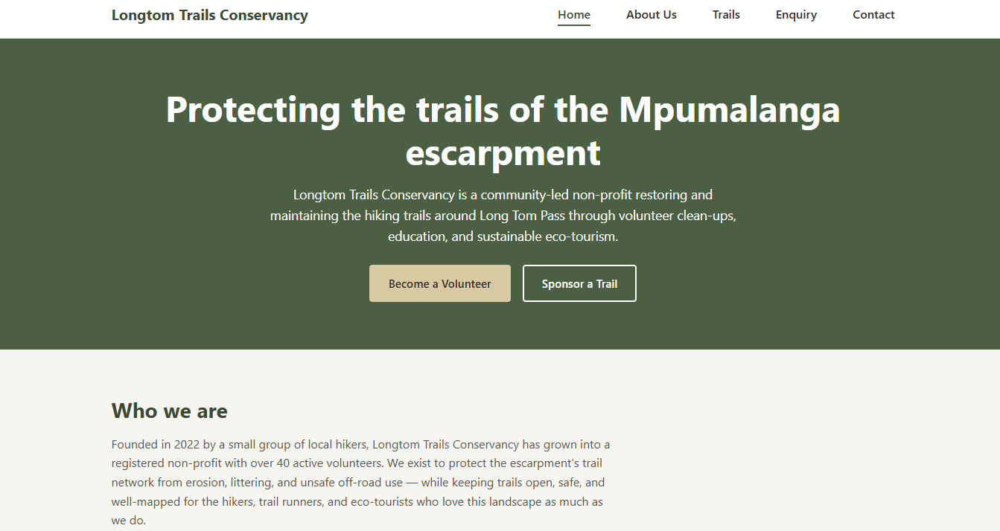

# Longtom Trails Conservancy — Website Project

## Student Information
- **Full Name:** [Retshepile Carol Lekhoane]
- **Student Number:** [ST10528017]
- **Subject:** [Web Development]
- **Group:** [4]

## Project Overview
Longtom Trails Conservancy is a fictional non-profit organisation based in Lydenburg,
Mpumalanga, dedicated to protecting and restoring the hiking trails of the Mpumalanga
escarpment through community-led conservation, volunteer clean-ups, and sustainable
eco-tourism. This project builds a five-page website for the organisation, covering its
mission, trail directory, volunteer/sponsor enquiries, and contact information.

Proposal 1 (Longtom Trails Conservancy) was approved by the lecturer following submission
of two project proposals, as required for Part 1.

## Website Goals and Objectives
- Raise public awareness of the conservancy's trail conservation work
- Recruit volunteers for monthly clean-up hikes
- Generate donations and sponsorships from local businesses and outdoor brands
- Provide hikers with safe, accurate, and up-to-date trail information

## Key Features and Functionality
- **Homepage** — mission statement, hero section, featured trail cards, volunteer/sponsor calls-to-action
- **About Us** — organisation history, mission & vision, meet-the-team section (7 volunteers)
- **Trails** — filterable trail directory (Easy / Moderate / Hard) with downloadable PDF maps
- **Enquiry** — two separate forms on one page: volunteer registration and sponsorship enquiry
- **Contact** — two physical locations (Lydenburg trailhead office, Dullstroom satellite point) shown on embedded maps, plus a general contact form
- Fully responsive design (desktop, tablet, mobile breakpoints)
- Mobile navigation menu toggle
- Client-side form validation on all forms
- Trail difficulty filter (JavaScript)

## Sitemap

## Wireframes

## Responsive Design Evidence (Part 2)
Screenshots below show the homepage tested across desktop, tablet, and mobile screen sizes
using browser developer tools (Microsoft Edge, device emulation mode).

**Desktop view:**

**Tablet view (iPad Air, 820px):**

**Mobile view (iPhone 15 Pro Max)

## Timeline and Milestones
- **Part 1** (research, sitemap, initial HTML skeleton, folder structure) — completed and submitted
- **Part 2** (CSS styling, responsive design, visual polish) — in progress, this submission
- **Part 3** (final debugging, accessibility pass, final GitHub commit) — upcoming

## File and Folder Structure

longtom-trails/
├── index.html
├── about.html
├── trails.html
├── enquiry.html
├── contact.html
├── styles.css
├── js/
│ └── script.js
├── images/
│ ├── trail-thumbnails/
│ └── team-photos/
└── docs/
├── sitemap.png
├── wireframe-homepage.png
├── wireframe-subpage-template.png
├── wireframe-trails.png
├── desktop-view.png
├── tablet-view.png
└── mobile-view.png

## Changelog

### Part 1 — Corrections following lecturer feedback (75/100)
- **Proposed Features and Functionality** (was 1/3 — "vague or incomplete"): Rewrote the
  Features and Functionality section of the Website Project Proposal with clear, specific
  detail on how each page works — e.g. how the Enquiry page hosts two separate forms for
  volunteers and sponsors, and how the Trails page directory is filterable by difficulty.
- **Technical Requirements** (was 1/2 — "vague or incomplete"): Added justification for
  every technical decision, including why Xneelo hosting was chosen over international
  alternatives, and why vanilla JavaScript was used instead of a framework.
- **Budget** (was 1/3 — "vague or unrealistic"): Replaced estimated figures with real
  researched pricing from Xneelo's published hosting and domain rates, with reasoning for
  each cost line.
- **Current Analysis** (was 2/3 — "adequate but lacks depth"): Expanded the analysis of the
  organisation's current (lack of) online presence.
- **Website Structure and Planning / Sitemap** (was 4/5): Added more detail to the sitemap
  and included it as a visual diagram (see Sitemap section above).
- **Content Research and Sourcing** (was 7/10): Reviewed and tightened content relevance
  across all pages.

### Part 2 — CSS Styling and Responsive Design
- Created external stylesheet (`styles.css`) linked to all five HTML pages
- Established base styles: font family (Montserrat/Source Sans 3), colour palette (moss
  green, charcoal, warm sand), and a CSS reset for cross-browser consistency
- Applied typography styles using `font-family`, `font-size`, `font-weight`, 
  `line-height`
- Built page layout using CSS Grid (card grids) and Flexbox (header, footer, forms)
- Added visual styling: `box-shadow` on cards with a hover lift effect, and an `:active`
  pressed state on primary buttons
- **Added a tablet breakpoint** (max-width: 1024px) in addition to the existing mobile
  breakpoint (max-width: 720px), adjusting container padding, hero spacing, and card grid
  sizing for medium screens
- Tested responsiveness using Microsoft Edge Developer Tools device emulation across
  desktop, iPad Air (tablet), and iPhone SE (mobile) — screenshots included above
- **Code comments** (was 2/5 — "vague, does not explain fully"): Reviewed and expanded
  comments throughout `styles.css` and `script.js` to more clearly explain what each
  block of code does and why it was implemented that way
- **GitHub commits** (was 2/5 — "few commits, lacking descriptions"): Committing more
  regularly going forward, with clear, descriptive commit messages for each change

## References
Nielsen Norman Group. (2024) *Website usability for nonprofit organisations*. Available at:
https://www.nngroup.com/articles/nonprofit-usability/ (Accessed: [20 August 2026])

W3C. (2023) *Web Content Accessibility Guidelines (WCAG) 2.1*. Available at:
https://www.w3.org/WAI/WCAG21/quickref/ (Accessed: [20 August 2026])

Google Developers. (2024) *Mobile-first indexing best practices*. Available at:
https://developers.google.com/search/mobile-sites (Accessed: [August 2026])

Xneelo. (2026) *Domain and hosting pricing*. Available at: https://www.xneelo.co.za
(Accessed: [15 August 2026])

Mpumalanga Tourism and Parks Agency. (2023) *Eco-tourism guidelines for protected trail
networks*. Nelspruit: MTPA Publications.

PART 2 References: 
1.MDN Web Docs. (2024) Using media queries. Available at:  
    https://developer.mozilla.org/en-US/docs/Web/CSS/CSS_media_queries/Using_media_queries  
    (Accessed: [10 September 2026]). 

2.MDN Web Docs. (2024) CSS box-shadow. Available at:  
    https://developer.mozilla.org/en-US/docs/Web/CSS/box-shadow  
    (Accessed: [12 September 2026]).  

3.CSS-Tricks. (2023) A complete guide to CSS media queries. Available at:  
    https://css-tricks.com/a-complete-guide-to-css-media-queries/  
    (Accessed: [12 September 2026]). 

4.MDN Web Docs. (2024) Client-side form validation. Available at:  
    https://developer.mozilla.org/en-US/docs/Learn/Forms/Form_validation  
    (Accessed: [14 September 2026]). 

5.Google Web Fundamentals. (2023) Responsive web design basics. Available at:  
    https://web.dev/responsive-web-design-basics/  
    (Accessed: [14 September 2026]). 

6.GitHub Docs. (2024) About commits. Available at:  
    https://docs.github.com/en/pull-requests/committing-changes-to-your-project/creating-and-editing-commits/about-commits  
    (accessed: [15 September 2026]).
